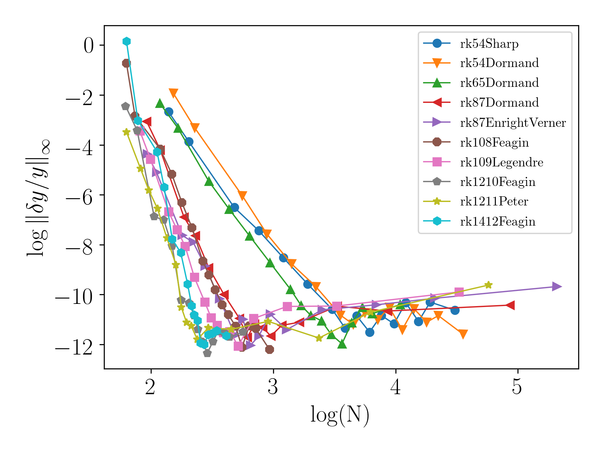
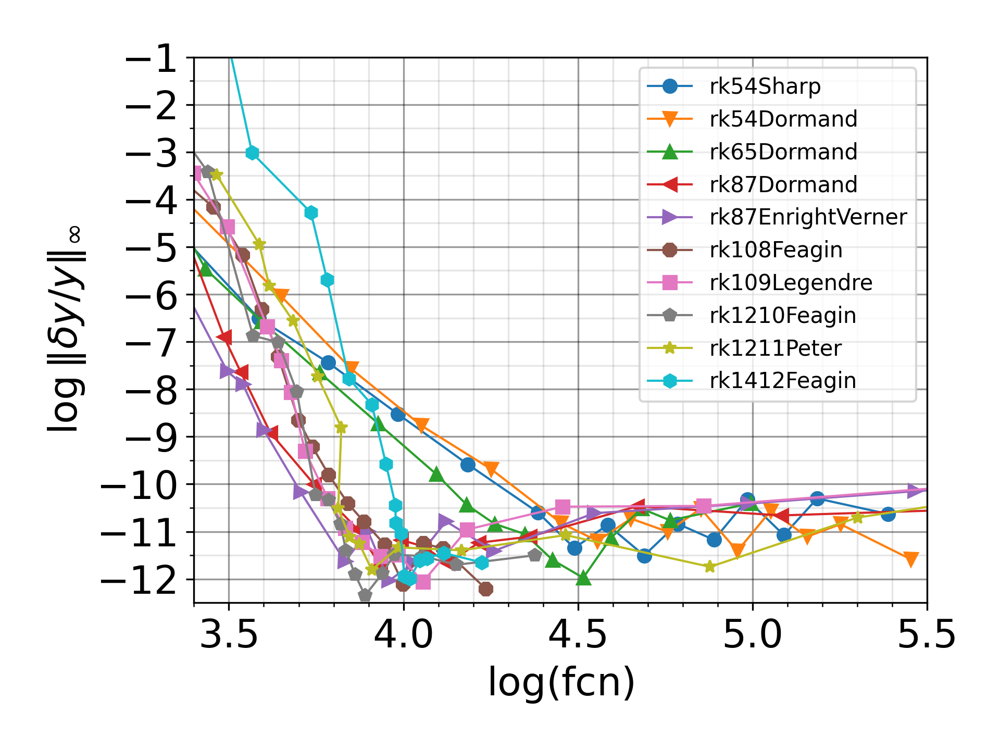
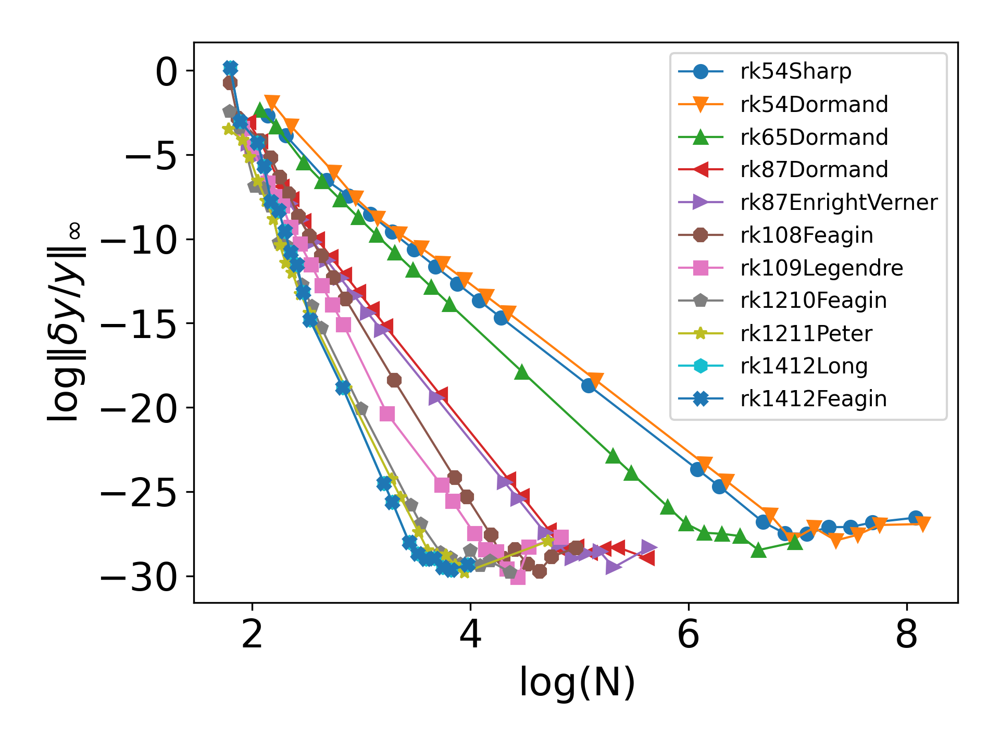
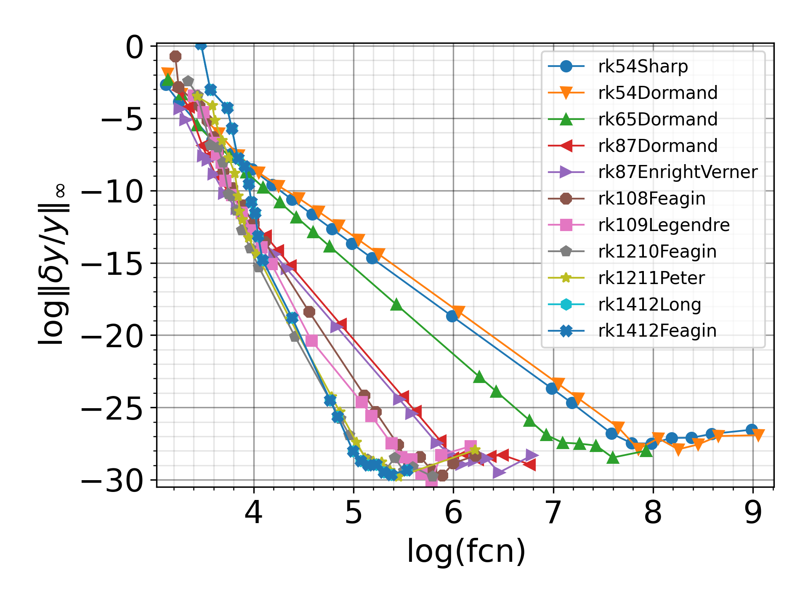

# Availble methods 
The available methods are: 
{'rk54Sharp', 'rk54Dormand', 'rk65Dormand', 'rk87Dormand', 'rk87EnrightVerner', 'rk108Feagin', 'rk109Legendre', 'rk1210Feagin', 'rk1211Peter', 'rk1412Long', 'rk1412Feagin'}

## Set up
You should have f2py and python packages like numpy, mpmath, matplotlib, time installed. f2py is usually located inside the Python's bin, something like:
```
/Users/MyUserName/Library/Python/3.7/bin/
```

Make sure you have all of these, you can then download and compile:
```
git clone git@github.com:hereiskaye/RKAdaptiveMethods.git
cd RKAdaptiveMethods
make all
```
If successful, you can now try:
```
python3 odefortran.py 
```
which should generate a file "Plots/odefortran_xy.png" that looks like: 


To compare these different solvers, you can run
```
python3 PleiadesMethods.py
```
which will takes about 72 second (on my Mac), and output two files: 
```
Plots/PleiadesMethods_scd_n.png
Plots/PleiadesMethods_scd_fcn.png
```
which should look like 
<p float="left">
 
 
</p>
where N represents the total number of steps taken during the integration, and fcn represents the number of times that y'=f(t,y) is evaluated. 


## Quadrupole precision:
The coefficients are calculated up to 60 digits for each of these method, and it is straight forward to switch to quad precision by changing all 'D-' and 'D\d' into 'Q-' and 'Q\d'. However, f2py does not work with quadruple precision, and it convert all numbers into KIND=8 before passing them to fortran.
Note that numpy does not work with quadrupole precision. The np.float128 is not quadrupole precision, but "extended-precision", and compatible with C ``long double`` but not necessarily with IEEE 754 quadruple-precision.  

Therefore, if you wish to pass quadrupole precision number using f2py, the working method is saving all the number to a *.f90 file, and re-compile this using f2py, and then just exceute this program. 
There is an example in branch "Quad". 

The results from quadrupole precision are:
<p float="left">
 
 
</p>

# Source and reference 
*_raw.py are downloaded from PeterStone's website (85 digits)
*.txt are downloaded from https://sce.uhcl.edu/rungekutta/ (60 digits)
