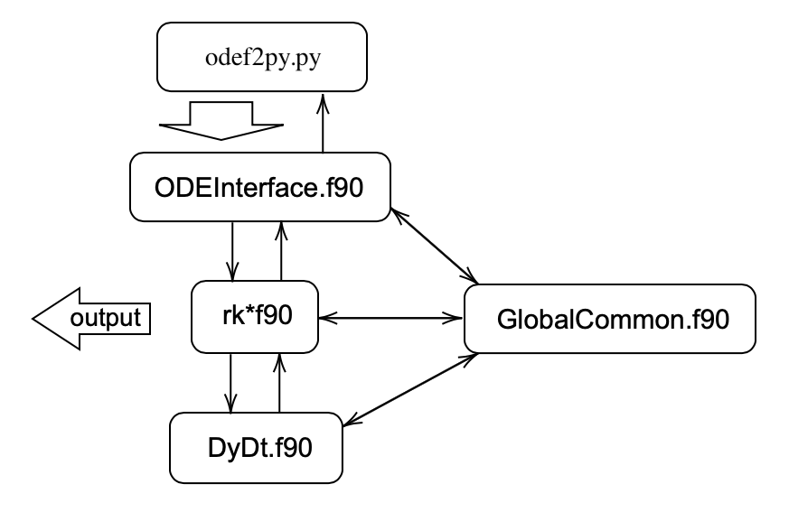
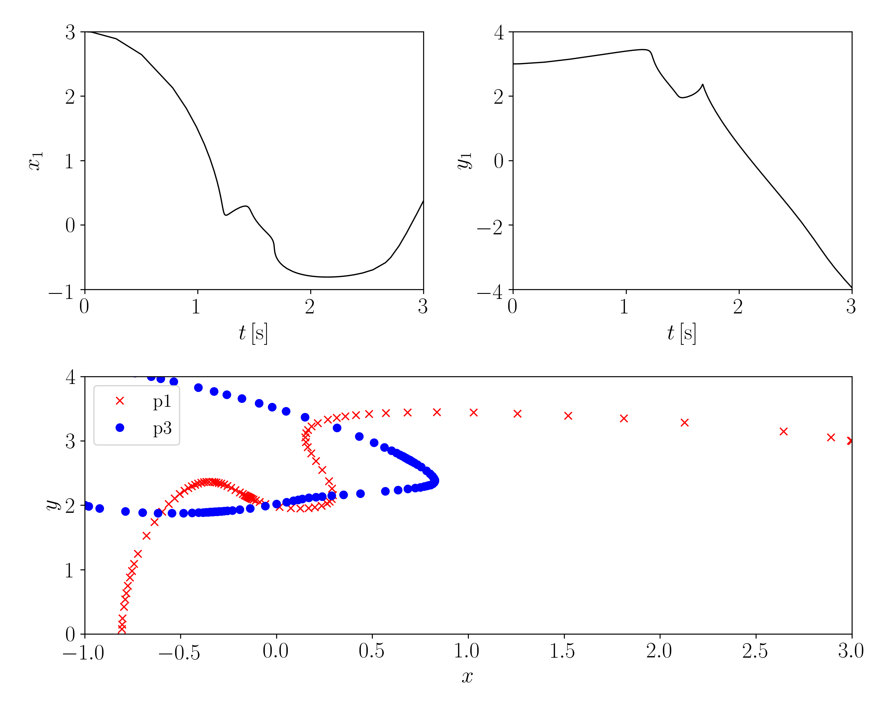
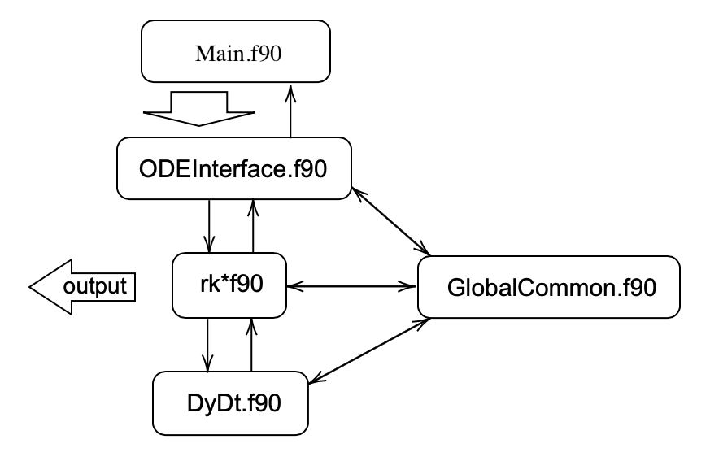

# Availble methods 
The available methods are: 
{'rk54Sharp', 'rk54Dormand', 'rk65Dormand', 'rk87Dormand', 'rk87EnrightVerner', 'rk108Feagin', 'rk109Legendre', 'rk1210Feagin', 'rk1211Peter', 'rk1412Long', 'rk1412Feagin'}
You have two choices: f2py (which serves as the interface between python and fortran) or a pure fortran code.

## Download
```
git clone git@github.com:hereiskaye/RKAdaptiveMethods.git
```


## Set up using f2py 
f2py has the advantage that you can change your inputs easily using python, it generates initial data using python and pass these info to the fortran program. 
The structure of the fortran code is:
<p float="left">
 
</p>
All the fortran scripts (except Fortran/Main.f90, which is not used by f2py) are compiled into a library "ode.so". 
The python script (odef2py.py) imports this library and pass the initial values, settings for solver to the fortran code. 

In order to use f2py, you need to configure your system environment. 
You should have f2py and python packages like numpy, mpmath, matplotlib, time installed. f2py is usually located inside the Python's bin, something like:
```
/Users/MyUserName/Library/Python/3.7/bin/
```
Make sure you add this path to your system $PATH. Then you may simply run
```
f2py 
```
which will output a long string with all the version information, etc. 

Once you have successfully set up your system environment, you may start compiling the code. 
In the top directory, you can run
```
make all
```
which will generate "ode.so". If successful, you can now run the test code by: 
```
python3 odef2py.py
```
which should generate a file "Plots/odef2py_xy.png" that looks like:
<p float="left">
 
</p>
To compare these different solvers, you can run

```
python3 PleiadesMethods.py
```

which will takes about 72 second (on my Mac), and output two files: 

```
Plots/PleiadesMethods_scd_n.png
Plots/PleiadesMethods_scd_fcn.png
```

which should look like 
<p float="left">
 
 
</p>
where N represents the total number of steps taken during the integration, and fcn represents the number of times that y'=f(t,y) is evaluated. 

## Using a pure fortran code
The structure of the fortran code is:
<p float="left">
 
</p>
Initial values, settings for the solver are all defined in Main.f90. To run the fortran code,
  simpily compile and execute it using the command:
  
```
make main
./main
```

The data file "Data/test.dat" will be generated, and you can use 

```
python3 odefortran.py 
```

to load the data and draw a figure. It should look like the figure shown above. 


## Quadrupole precision:
The coefficients are calculated up to 60 digits for each of these method, and it is straight forward to switch to quad precision by changing all 'D-' and 'D\d' into 'Q-' and 'Q\d'. However, f2py does not work with quadruple precision, and it convert all numbers into KIND=8 before passing them to fortran.
Note that numpy does not work with quadrupole precision. The np.float128 is not quadrupole precision, but "extended-precision", and compatible with C ``long double`` but not necessarily with IEEE 754 quadruple-precision.  

Therefore, if you wish to pass quadrupole precision number using f2py, the working method is saving all the number to a *.f90 file, and re-compile this using f2py, and then just exceute this program. 
There is an example in branch "Quad". 

The results from quadrupole precision are:
<p float="left">
 
 
</p>

# How to adapt this code to your probelm 
The structure of the fortran code is:
<p float="left">
 
</p>

You will need to modify Fortran/GlobalCommon.f90, Fortran/DyDt.f90 and Fortran/Main.f90.
Fortran/Main.f90 is the main program, where you define the filename for the data file,
  the initial values, the time interval, time steps, etc. 
The differential equation (i.e. y' = f(t,y) with y(n)) is defined in DyDt.f90, which you need to modify.
The subroutine should look like dev(t,y,dy,test), which takes in t,y(n) and output dy(n) and test.
The file GlobalCommon.f90 is used to pass common variables and parameters in the code.  


If you would like to use f2py instead, you may skip Fortran/Main.f90 and only modify Fortran/GlobalCommon.f90 and Fortran/DyDt.f90.
You will need to modify odepython.py. This file is the interface between fortran and python codes, but can also serve 
  as a test program.  
The subroutine "solve_ivp_" should work for any other problems 
  and you may want to keep it what it is. 
You may want to modify the lines after 
```
if __name__ == '__main__':
```
where the initial values, setting of the solver, etc, are defined. 

## The ODE formula
By default, this code uses dev(t,y,dy,test) which takes in t,y(n) and output dy(n) and test.
If you have extra variables that you would like to pass to the ODE (e.g. if you have y' = f(t, y, a, b), where a,b are variables),
  it is suggested to put a,b in GlobalCommon.f90 and use them as global variables. 

However, the situation can be quite complicated sometimes, when this set up will fail. 
In this case, you might have no choice but modifying dev(t,y,dy,test) to dev(t,y,dy,test,a,b)
  with a,b are variables either INTENT(IN) or INTENT(OUT) or INTENT(INOUT).
You will also need to update rk*f90 as well. You can certainly modify them one by one, but this process can be quite tedious.
There are ways to modify all of them quickly. You can modify the file
```
Convert0.py
```
and then execute it. New rk*f90 files will be automatically generated by running: 
```
make Solvers
```
Remember to update the ABSTRACT INTERFACE in GlobalCommon.f90 which should resemble your new dev() subroutine.


# Source and reference 
*_raw.py are downloaded from PeterStone's website (85 digits)
*.txt are downloaded from https://sce.uhcl.edu/rungekutta/ (60 digits)

